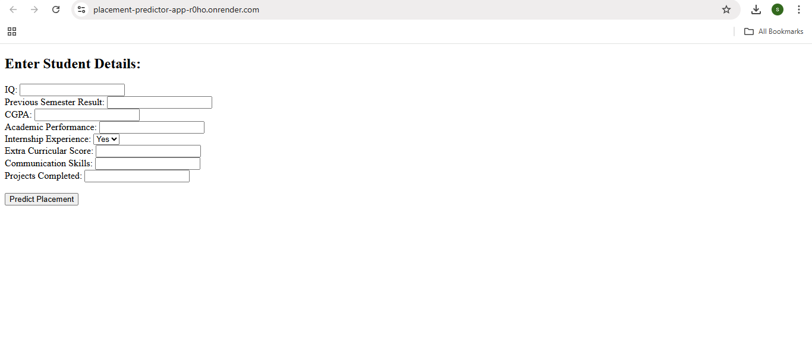
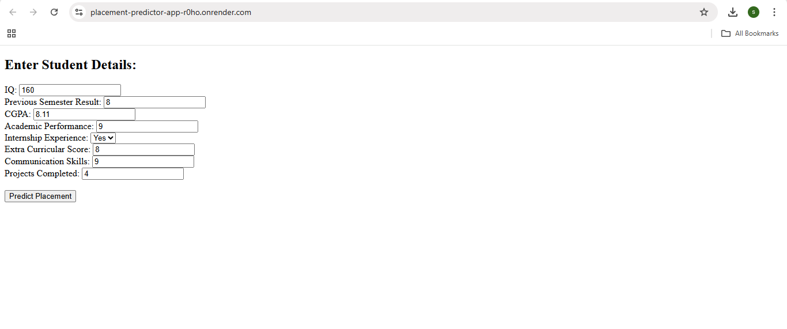
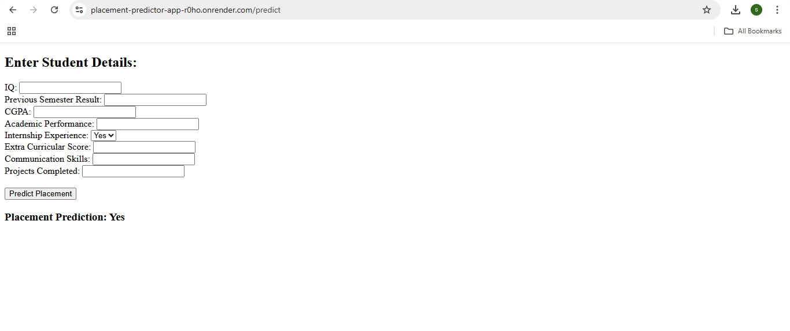

# placement-predictor-app

This project predicts whether a student is likely to be placed based on academic and personal attributes. The model is trained using **supervised machine learning (Logistic Regression)** and deployed on the web using Render.

---

## Features

- Simple and responsive form-based UI.
- Takes student data as input
- Predicts whether the student is likely to be placed
- Deployed online using Render
- Supports both API and web interface


---

## Prerequisites

Make sure the following are installed:

- Python 3.6 or higher  
- pip (Python package manager)
- Frontend: HTML (Jinja template)
- Backend: Flask (Python)
- Modeling: scikit-learn (Logistic Regression)
- Deployment: Render (cloud hosting)

---

## Installation

### 1. Clone the repository

```
git clone https://github.com/sandhiya0147/placement-predictor-app.git
cd placement-predictor-app
```

### 2. Install dependencies

```
pip install -r requirements.txt
```

---

## Running the Application

Start the Flask development server:

```
python app.py
```

Then open your browser and go to:

```
http://127.0.0.1:5000
```

---

## How It Works

- User submits details (IQ, CGPA, internship, etc.) through a web form on the homepage.
- Flask backend receives the input and processes it into a format suitable for machine learning prediction.
- Pre-trained Logistic Regression model (placement_model.pkl) is loaded using joblib to make the prediction.
- Prediction result (Placed or Not Placed) is generated based on the student’s input features.
- Result is displayed back to the user on the webpage in a clean and simple message.

---

## File Structure

```
placement-predictor-app/
├── app.py 
├── placement_model.pkl
├── requirements.txt
├── render.yaml
├── README.md 
│
├── templates/
│   └── index.html
├── assests/
│   ├── input_form.png
│   ├── filled_input.png
│   └── prediction_result.png
```

---

## Future Improvements

- Add more machine learning models such as Random Forest or XGBoost to improve prediction accuracy.
- Integrate a database to store user inputs and prediction history for analysis and tracking.
- Enhance the user interface with responsive design and better usability for mobile and desktop users.

---


## Step-by-Step Guide: How to Use the Movie Interest Predictor


### Step 1: Input Form
  

### Step 2: Filled Form 
  

### Step 3: Prediction Result


---

## Live Demo

[Click here to view the deployed app](https://placement-predictor-app-r0ho.onrender.com/)

---
